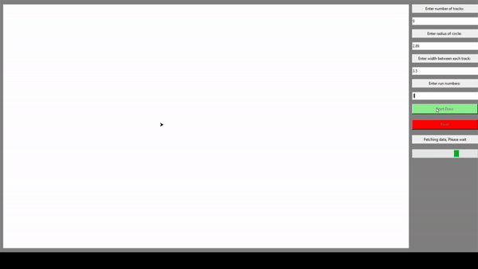

# Agriculture Manouvering Problem using Genetic Algorithm and Python

## How to use :
 1. Open [app.exe](dist/app.exe) at `dist/app.exe`
 2. Input your track, radius, width, and run number
 3. Click the `Start Draw` button
 4. Wait for the algorithm to finish (*it will take a while based on your run number, computer spec, and your track complexity data*)
 5. After the algorithm finish, you can see the result on the screen
 6. If you want to start a new simulation, click the `Reset` button

### Library used :
- turtle
- tkinter
- requests
- pyinstaller
- numpy
